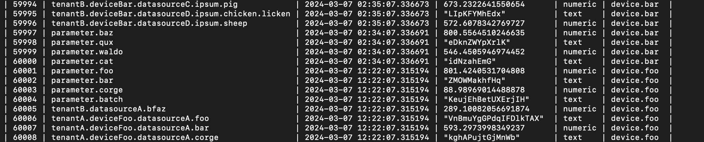

# Time Series Visualizer

## Description and Features
This application reads Factory X's time-series data (in JSON format) captured from a several sensors through a set of monitoring devices.
The data is then pushed into MySQL database, adding a column which stores the device name.
The Python-based API, FastAPI, retrieves the data from MySQL and uploads it into a localhost.
A web application is created using React.js to visualise this time-series data.

## Technology Stack
MySQL, FastAPI, Python, React.js

## Installation

### Prerequisites
#### Backend
Packages to be installed are listed in backend/requirements.txt, and are as follows:
- fastapi==0.111.0
- mysql-connector-python==8.4.0
- uvicorn==0.29.0
- pytest==8.2.0
These tools can be installed by running in your terminal:
pip install [package]

#### Frontend
- node.js [node v16.20.2]
- npm [npm 8.19.4]
Download and install from [Node.js official website](https://nodejs.org/en/download/).
Be sure to download the appropriate version for your Operating System.

### Backend Setup
Ensure your are in backend/ for the following steps

1. To push the date onto the MYSQL database, in your terminal, run:
python push_mysequal.py
2. To open mySQL to confirm data was successfully stored in the database, in your terminal, run:
mysql -u root -p time_series_db
3. Now that you're in MySQL, view the data by running:
SELECT * FROM device_data;
4. Retrieve the data from MySQL database using FastAPI, in your terminal, run:
uvicorn main:app --reload --host 0.0.0.0 --port 8000
5. To test that the data has been successfully retrieved using FastAPI, in your browser, type:
http://localhost:8000/data/
6. To further test that the data has been successfully retrieved using FastAPI, run a unit test:
pytest test_main.py

### Frontend Setup
Ensure you are in frontend/ for the following steps
These steps take place after following the "Backend Setup" instructions

7. To ensure you are granting React (in localhost3000) access to the data (in localhost8000), your terminal, run:
node server.js
8. To open the web application, in your terminal run:
npm start

## Guidance using Examples
The following screenshots are examples of what you should expect after running a given command

### Backend Setup
####Steps 1 - 3
After Steps 2 and 3 (running mysql -u root -p time_series_db; SELECT * FROM device_data;)
The dataset should look as follows:

####Step 5
After Step 5 (retrieving the data from MySQL using FastAPI)
The dataset should look as follows:

### Frontend Setup
####Steps 7
After Step 7 (granting access to data retrieved from FastAPI)
The dataset should look as follows:

####Steps 8
After Step 8 (strating the React.js application)
The landing page will look as follows:

## Contributing
Guidelines for how to contribute to the project.

## License
State the license (if any).

## Contact Information
How to reach you or the maintainer.