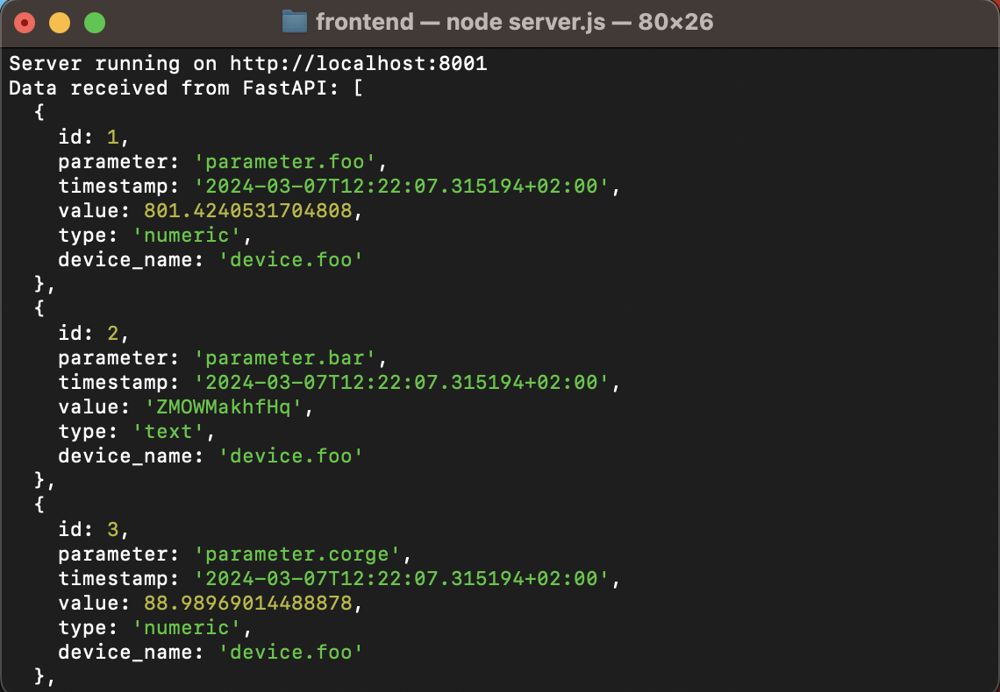
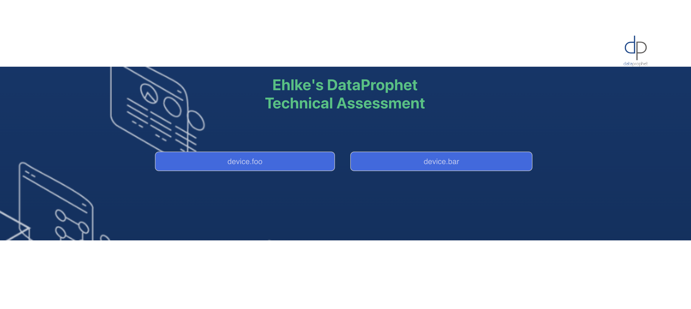

# Time Series Visualizer

## Description and Features
This application reads Factory X's time-series data (in JSON format) captured from a several sensors through a set of monitoring devices.
The data is then pushed into SQLite database, adding a column which stores the device name.
The Python-based API, FastAPI, retrieves the data from SQLite and uploads it into a localhost.
A web application is created using React.js to visualise this time-series data.

## Technology Stack
SQLite, FastAPI, Python, React.js

## Installation
### Prerequisites
#### Backend
Packages to be installed are listed in backend/requirements.txt, and are as follows:
- fastapi=i=0.111.0
- uvicorn==0.29.0
- pytest==8.2.0
These tools can be installed by running in your terminal:
pip install [package]


#### Frontend
- node.js [node v16.20.2]
- npm [npm 8.19.4]
Download and install from [Node.js official website](https://nodejs.org/en/download/).
Be sure to download the appropriate version for your Operating System.

Then run:
    ```npm install express cors axios```
    ```npm install```


### Backend Setup
Ensure your are in backend/ for the following steps

1. To push the date onto the SQLite database, in your terminal, Open sql:

    ```python sqlite.py```

2. To do a unit test to make sure this step was successful, run:

    ```pytest sqlite_unittest.py```


3. Retrieve the data from SQLite database using FastAPI, in your terminal, run:

    ```uvicorn main:app --reload```

4. To test that the data has been successfully retrieved using FastAPI, in your browser, type:

    ```http://localhost:8000/data/```

5. To further test that the data has been successfully retrieved using FastAPI, run a unit test:

    ```pytest test_main.py```


### Frontend Setup
Ensure you are in frontend/ for the following steps
These steps take place after following the "Backend Setup" instructions

6. To ensure you are granting React (in localhost3000) access to the data (in localhost8000), your terminal, run:

    ```node server.js```

8. To open the web application, in your terminal run:

    ```npm start```

## Guidance using Examples
The following screenshots are examples of what you should expect after running a given command

### Backend Setup
#### Steps 1 & 2
At Step 1, you converted the JSON data into a database. Step 2 is a unit test to ensure this has successfully been implemented.
The unittest should look 
The dataset should look as follows:


#### Step 3
After Step 3 (retrieving the data from SQLite using FastAPI)
After a successful run, your terminal should look as follows:


#### Step 4 
After Step 4, opening localhost:8000/data/ in your web browser should look as follows: 


#### Step 5
Step 5 is a unit test which provides an additional way to track if the data was successfully retrieved using FastAPI.
After a successful run, your terminal should look as follows:


### Frontend Setup
#### Steps 6
After Step 6 (granting access to data retrieved from backend to display on frontend)
After successfully runnding server.js, the dataset should look as follows:



#### Steps 7
We made it!
After Step 7 (visualising the data)
The landing page will look as follows:




## Contact Information
ehlke.hepworth@outlook.com