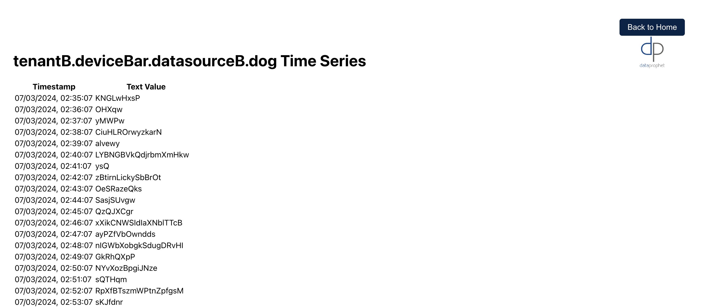

# Time Series Visualizer

## Description and Features
This application captures time-series data (in JSON format) from a several sensors through a set of monitoring devices at Factory X.
The data is then stored in a SQLite database, with an additional column to store the device name.
The Python-based API, FastAPI, retrieves the data from SQLite and makes it available on a local server.
A web application built with React.js is used to visualise this time-series data.

### Information on Data Caputred and Presented in this application.
- There are two Sensors, DeviceFoo and DeviceBar.
- Each Sensor contains four Datasources (Datasource A - D).
- Each Datasourse contains two datasets (one numeric and one text).
- See the screenshots under Step 7 for more details.

## Before starting
Please note:
- This application is optimised for laptop resolutions

## Technology Stack
SQLite, FastAPI, Python, React.js

## Installation
### Prerequisites
#### Backend
- This backend is run using python==3.10.12
- Packages to be installed are listed in backend/requirements.txt, and are as follows:
-- fastapi==0.111.0
-- uvicorn==0.29.0
-- pytest==8.2.0
These tools can be installed by running in your terminal:
pip install [package]


#### Frontend
In the frontend/ directrory, download and install from [Node.js official website](https://nodejs.org/en/download/).
Be sure to download the appropriate version for your Operating System.
- node.js [node v16.20.2]
- npm [npm 8.19.4]


Once node is intalled, run:
    ```npm install```
And then run:
    ```npm install express cors axios```


### Backend Setup
Ensure your are in the backend/ directory for the following steps

1. To push the date onto the SQLite database, in your terminal, run:

    ```python sqlite.py```

2. To test whether Step 1 was successful, run the following unit test:

    ```pytest sqlite_unittest.py```


3. To retrieve the data from SQLite database using FastAPI, in your terminal, run:

    ```uvicorn main:app --reload```

4. To test that the data has been successfully retrieved using FastAPI, in your browser, type:

    ```http://localhost:8000/data/```

5. To further test that the data has been successfully retrieved using FastAPI, run a unit test:

    ```pytest fastapi_unittest.py```


### Frontend Setup
Ensure you are in frontend/ for the following steps
These steps take place after following the "Backend Setup" instructions

6. To ensure you are granting React (in localhost:3000) access to the data (in localhost:8000/data/), in your terminal, run:

    ```node server.js```
- THis will execuse server.js to "listen to" the data in localhost:8001/data/ which is then where the data will be fetched from for visualisation using React.

8. To open the web application, in your terminal run:

    ```npm start```

## Guidance using Examples
The following screenshots are examples of what you should expect after running a given command

### Backend Setup
#### Steps 1 & 2
At Step 1, you converted the JSON data into a database. Step 2 is a unit test to ensure this has successfully been implemented.
The unittest should look 
The dataset should look as follows:


#### Step 3
After successfully running Step 3 (retrieving the data from SQLite using FastAPI),
your terminal should look as follows:


#### Step 4 
After Step 4, opening localhost:8000/data/ in your web browser should look as follows: 


#### Step 5
Step 5 is a unit test which provides an additional way to track if the data was successfully retrieved using FastAPI.
After a successful run, your terminal should look as follows:


### Frontend Setup
#### Steps 6
After successfully running Step 6 (granting access to data retrieved from backend to display on frontend),
the dataset should look as follows in your terminal:


#### Steps 7
You made it!
After Step 7 (visualising the data)
The landing page will look as follows:


There are two dropdown menus for each sensor, each providing access to four datasources


Each datasource shows two datasets, one numerice and the other text.


Each datasource shows two datasets, one numerice and the other text.



### Reasoning behind decisions made

#### SQLite
- SQLIte offers a simple and lightweight solution to store time-series data.
- For this application, choosing a database that does not require complex authentication mechanisms provided a straightforward and efficient solution.

#### Data Storage Structure
- Storing an additional column for the device name in the database helps in easily querying data based on the device, enhancing the manageability of data.

#### Four Datasources with Two Datasets
- I filtered out the parmeters containing "datasourceA/D" to use as the data to represent.
- To represent numeric and text data, two parameters were chosen from each datasource: one a text type and the other a numeric type.


### Additional Suggestions
Improvements need to be made throughout the application. Here are a few suggestions:

- This application is developed for laptop screens. Therefore, with more time, it needs to be improved to fit multiple screen-resolutions.
- Extend the analysis to all paramters available in sample10k.json
- Build a zoom-in capability for the x- and y-axes.
- Improve efficiency of frontend application. For example, design of Figures should be centralised in a single .js file, rather than being duplicated across multiple individual Line*.js files.


## Contact Information
ehlke.hepworth@outlook.com
